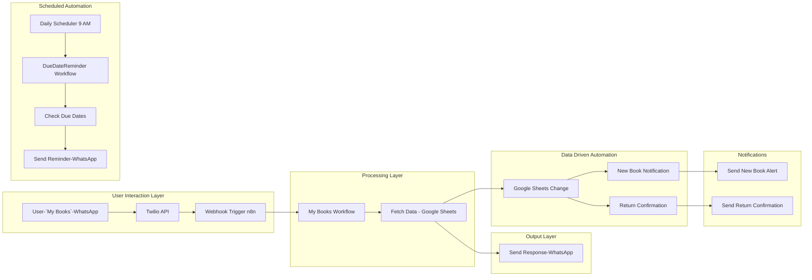

# 🤖 MyLibrary Bot: An n8n-Powered WhatsApp Library Assistant
A powerful WhatsApp Library Assistant built with n8n and Twilio. It allows students to get a full summary of their library account and receive automatic notifications for new books, returned books, and daily due date reminders.

   

#
A comprehensive, multi-workflow automation suite designed to bring your library's communication into the modern era. MyLibrary Bot uses n8n to connect a simple Google Sheet database with the Twilio API, providing students with automated notifications and an interactive WhatsApp bot to manage their library account.

## ✨ Key Features

This project is an ecosystem of automated services, each designed to handle a specific library task.

* 📖 **On-Demand Book Summary:** Students can text "My Books" to the bot and receive an instant, detailed summary of their account, including books to be returned, previously returned books, and any books already marked as lost.
* 🎉 **Automatic New Book Notifications:** When a librarian issues a new book by adding a row to the Google Sheet, the student instantly receives a WhatsApp confirmation with the book title and due date.
* ✅ **Automatic Return Confirmations:** When a librarian updates a book's status to "Yes" in the sheet, the student receives an instant confirmation message.
* ⏰ **Daily Due Date Reminders:** A workflow runs automatically every morning to find all books that have not yet been returned and sends a polite due date reminder via WhatsApp to the respective students.

## ⚙️ System Architecture (MyLibrary-Bot)

## 🛠️ Tech Stack

* **Automation Engine:** [n8n.io](https://n8n.io/)
* **Communication API:** [Twilio API for WhatsApp](https://www.twilio.com/whatsapp)
* **Database:** [Google Sheets](https://www.google.com/sheets/about/)
* **Core Logic:** [Node.js](https://nodejs.org/) / [JavaScript](https://developer.mozilla.org/en-US/docs/Web/JavaScript) (within n8n's Code nodes)

## 🚀 Setup & Installation

This project contains multiple, separate workflows. To get them running, follow these steps.

**You will need:**
* An **n8n account** (Cloud or self-hosted).
* A **Twilio account** with a WhatsApp-enabled phone number.
* A **Google account** with a Google Sheet prepared with the necessary columns.

**Installation Steps:**

1.  **Import Workflows:** In your n8n instance, import each of the five provided workflow `.json` files: `my-books-summary.json`, `instant-issue-confirmation.json`, `new-book-notification.json`, `return-status-confirmation.json`, and `daily-reminder-service.json`.
2.  **Configure Credentials:** For each workflow, open the Google Sheets and Twilio nodes and configure the **Credentials** by selecting your connected accounts.
3.  **Set Up the Interactive Bot:** This project contains one interactive workflow, `My Books (Interactive)`, which is triggered by a webhook.
    * To make it work, copy the Webhook URL from its `Webhook` trigger node.
    * In your Twilio Console, paste this URL into your phone number's "A MESSAGE COMES IN" field and save.
    * **Important Note:** A Twilio number can only point to one webhook URL at a time. This means only the `My Books (Interactive)` workflow can be used for interactive chats with this setup.
4.  **Activate Workflows:** Set the workflows you wish to use to **Active**.
    * **Limitation:** Most n8n plans (especially free or trial versions) have a limit on how many workflows can be active at once. You may need to choose which automations are most important to you and only activate those.

## 📂 Workflows Overview

This project contains the following workflows:

* **`my-books-summary.json`:** An interactive workflow named `My Books (Interactive)` that listens for the text "My Books" and replies with a complete summary of the student's library account status.
* **`instant-issue-confirmation.json`:** An automated workflow named `Instant Issue Confirmation` that sends a confirmation to a student as soon as a new book is issued to them in the Google Sheet.
* **`new-book-notification.json`:** A similar workflow for new book issue confirmations, named `New Book Notification`.
* **`return-status-confirmation.json`:** An automated workflow named `Return Confirmation` that sends a "Thank you for returning" message when a book's status is updated in the sheet.
* **`daily-reminder-service.json`:** A scheduled workflow named `Daily Due Date Reminder` that runs once a day to remind students of their pending due dates.

## 📚 MyLibrary-Bot Workflow Snapshots

A visual overview of all workflows powering **MyLibrary-Bot**.

## 1. All Workflows Overview

  

## 2. My Books Workflow

  
  

  

## 3. Instant Issue Confirmation Workflow

  
  

## 4. Daily Reminder Service Workflow

  
  

## 5. Librarian Initiated Workflow

  
  

## 💡 Idea Ownership

The idea, workflow design, and system architecture behind **MyLibrary-Bot** are my original work.  

This repository is shared here for educational and demonstration purposes.

📩 For collaborations or queries, connect me at **geethikaadasari@gmail.com**
